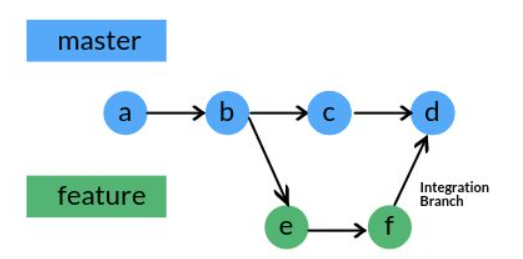

# Introduction to Git commands

## Terms and concepts

- **Directory** - a filesystem object that houses files and other directories (aka sub directories). In windows people might call a directory  **a folder** 

- **Git repository** --hereafter refers as **repo** -- can be thought as a 
container housing collection of files of various different versions of a working project. Inside the project the **.git/** folder tracks all changes made to files in your project, building a history over time. If you delete the .git/ folder, then you delete your project’s history

- **Git branch** consists of a separate list of commits from other branches. It allows you to work on different features or bug fixes in parallel without affecting the main line -- i.e. master branch-- of development.

    

- **Master** branch - is the default branch when you create new repo (i.e. run *git init* command). We rename **master** to **main** branch to avoid using the word in our vocabulary and stay consistent with GitHub

- **Git staging area** -- aka the index -- is where changes are staged and reviewed before commited. When you run git add command, Git takes a snapshot of the changes you’ve made in your files, adding this snapshot to the staging area. 

- **Git commit ID** - a 40-hex-digit string that uniquely identify the commit in repository history

- **HEAD** is a reference to the last commit in the currently checked-out branch. We can think of HEAD as a pointer to the most recent commit -- unless we check out an old commit. 

- **.gitignore** is a text file placed in your repo that tells Git not to track certain files and folders. To stop tracking a file that is currently tracked, use **git rm --cached** to remove the file from the index. The filename can then be added to the .gitignore to stop the file from being reintroduced in later commits.

## Lecture 1
1- Slides: https://courses.cs.washington.edu/courses/cse403/13au/lectures/git.ppt.pdf

2- Git commands 

    # git init can be used to convert an existing, unversioned project 
    # to a Git repo or initialize a new, empty repo. 
    # git init . start a new repo at current folder

    git init . 

    # git status shows the state of the working folder and the staging area. 
    # It shows staged changes and the files that aren’t being tracked by Git

    git status 

    # git add - add file contents to the staging area
    # The command updates the index using the current content found in the 
    # working tree, to prepare the content staged for the next commit.

    # add changes to tracking files in the current folder to the index
    git add .

    # Add changes to all java source files in current folder to the index
    git add *.java 

    # Add changes to all tracking files in all folders to staging area
    git add --all 

    # git commit - commit staged changes to the repository    
    git commit -m "Implement minimax algorithm for tic-tac-toe game"

    # git log - shows the commit logs.

    # Show the whole commit history, one line per commit
    git log --oneline 

    # Show the whole commit history, but skip any merges
    git log --no-merges
    
    # Show all commits since version v1.0 for any file in the subsystem/vision 
    # or command/auto sub-directories    
    git log v1.0.. subsystem/vision command/auto

    # Show all commits since 2 weeks ago
    git log --since="2 weeks ago"

3- Assignment: [Assign1.md](./assignments/assign1/Assign1.md)