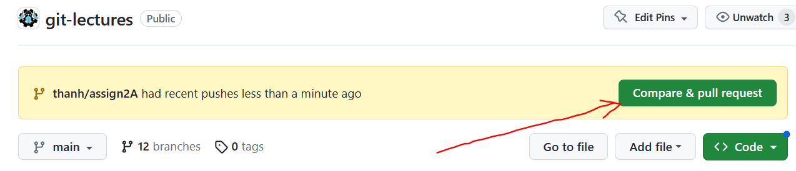

# Assign 2 - branching, merging, pull requests

In this assignment you will checkout 2 branches from  [git-lectures repo](https://github.com/FRC-1294/git-lectures) and create 2 corresponding local branches on your computer.

- One branch has the code to measure the performance of the `aiMove()` function. aiMove() implements the logic that the AI player uses to play tic-tac-toe game. 

- The other branch has the code to improve the performance of the `aiMove()` using [Alpha-beta pruning](https://en.wikipedia.org/wiki/Alpha%E2%80%93beta_pruning) algorithm.

**To start the assignment 2:**

- Open Git Bash Shell
- If you already have a **clone** of [git-lectures repo](https://github.com/FRC-1294/git-lectures) on your local folder then 

        cd <local_repo_folder>
        git pull 

- If you do not have a **clone** of [git-lectures repo](https://github.com/FRC-1294/git-lectures) on your local folder then 

        cd ~/
        git clone git@github.com:FRC-1294/git-lectures.git assign2
        cd ~/assign2

>>You can choose to work either on `Assign 2A` or `Assign 2B`
>>- If you are familiar with Javascript, work on Assign 2A 
>>- If you are familiar with Python, work on Assign 2B

- Once you complete Assign 2A or Assign 2B, point your browser to [https://github.com/FRC-1294/git-lectures](https://github.com/FRC-1294/git-lectures) to see your new pushed branch. 

>> Click on the `Compare & pull request` button to create your PR
>> 

# Assign 2A

- Checkout the 2 needed branches locally

        git checkout assign2A/MeasurePerformance
        git checkout assign2A/FixPerformanceProblem
        git branch 

- Checkout main and create new branch `<your_name>/assign2A`

        git checkout main
        git checkout -b <your_name>/assign2A
        git status
        git log --graph --decorate --oneline

- Merge `assign2A/MeasurePerformance` into your new `<your_name>/assign2A` branch

        git checkout <your_name>/assign2A

        # Expecting no merge conflict
        git merge assign2A/MeasurePerformance

        git status
        git log --graph --decorate --oneline

- Use a browser (Edge or Chrome) to open `git-lectures/assignments/tic-tac-toe-js/index.html` file. You can use File Explorer to double click on tic-tac-toe-js/index.html file to run the game .

        # Complete a game and note down number of function calls
        # to a file, perf.txt, and add the file to the repo
        echo "(261965, 295527)" >> perf.txt
        git add perf.txt
        git commit -m "Record # function calls before merging the fix."

- Merge `assign2A/FixPerformanceProblem` into `<your_name>/assign2A` branch

        git checkout <your_name>/assign2A

        # Expecting merge conflicts 
        git merge assign2A/FixPerformanceProblem

        > You should see `CONFLICT (content): Merge conflict in assignments/tic-tac-toe-js/ai.js`

        git status

- Use VS Code to open `assignments/tic-tac-toe-js/ai.js` and manually fix the merge conflicts.
> Once you are done with merge conflicts resolution:
>> Test the merge, double click on `assignments/tic-tac-toe-js/index.html` to complete the tic-tac-toe game and record the number of calls into perf.txt file
>>> Then run `git add` and `git merge --continue` to complete the merge. **git merge --continue** will open an editor and you can close it by typing `:x!` then press `ENTER`

        # Once you use VS Code to manually resolve conflicts...
        # Run assignments/tic-tac-toe-js/index.html to complete a game
        # Then record the number of function calls to perf.txt

        echo "(8825, 10392)" >> perf.txt
        git status
        git add .

        # git merge --continue will open an editor. To exit, type :x!
        git merge --continue

        git status
        git log --graph --decorate --oneline

- Run `git push` to push <your_name>/assign2A branch to GitHub

# Assign 2B

> Make sure you have python 3.10 or later version installed on your computer before going through the below steps. To install python 3.10+, download it from [https://www.python.org/downloads/](https://www.python.org/downloads/) and run the installer

- Checkout the 2 needed branches locally

        git checkout assign2B/MeasurePerformance
        git checkout assign2B/FixPerformanceProblem
        git branch 

- Checkout main and create new branch `<your_name>/assign2B`

        git checkout main
        git checkout -b <your_name>/assign2A
        git status
        git log --graph --decorate --oneline

- Merge `assign2B/MeasurePerformance` into your new `<your_name>/assign2B` branch

        git checkout <your_name>/assign2B

        # Expecting no merge conflict
        git merge assign2B/MeasurePerformance
        git status
        git log --graph --decorate --oneline

- Run `python runner.py` to test and record the number of function calls to perf.txt
> Before running `python runner.py`, make sure you install the pygame package by running `pip install -r requirements.txt` 

        # ONE TIME Only
        pip install -r requirements.txt

        python runner.py

        # Complete a full tic-tac-toe game
        # then record the number of function calls to perf.txt
        echo "(261965, 295527)" >> perf.txt

        git add perf.txt
        git commit -m "Record # function calls before merging the fix."

- Merge `assign2B/FixPerformanceProblem` into `<your_name>/assign2B` branch

        git checkout <your_name>/assign2B

        # Expects merge conflicts 
        git merge assign2B/FixPerformanceProblem

        > You should see `CONFLICT (content): Merge conflict in assignments/tic-tac-toe-python/tictactoe.py`

        git status

- Use VS Code to open `assignments/tic-tac-toe-python/tictactoe.py` and manually fix the merge conflicts.

> Once you are done with merge conflicts resolution:
>> Test the merge. run `python runner.py` to complete the tic-tac-toe game and record the number of calls into perf.txt file

>>> Then run `git add` and `git merge --continue` to complete the merge. **git merge --continue** will open an editor and you can close it by typing `:x!` then press `ENTER`

        # Once you use VS Code to manually resolve conflicts...
        # Run python runner.py to complete a game
        # Then record the number of function calls to perf.txt

        echo "(8825, 10392)" >> perf.txt
        git status
        git add .

        # git merge --continue will open an editor. To exit, type :x!
        git merge --continue

        git status
        git log --graph --decorate --oneline

- Run `git push` to push <your_name>/assign2B branch to GitHub

# References 
> To learn more about git merge see https://git-scm.com/book/en/v2/Git-Branching-Basic-Branching-and-Merging
